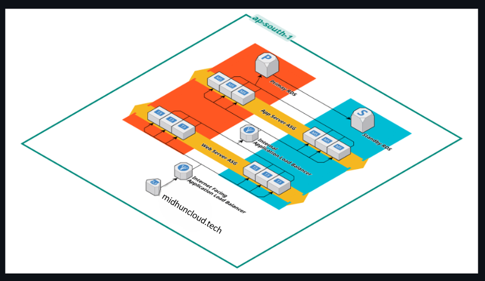

# Scalable AWS 3-Tier Architecture

A production-style scalable 3-tier architecture deployed on AWS using EC2, Application Load Balancer, Auto Scaling, RDS, VPC, and Security Groups.

## 📌 Project Overview

This project demonstrates how to build a secure, scalable, and highly available 3-tier architecture on AWS.

The infrastructure separates the application into three independent layers:

1. Web Tier
2. Application Tier
3. Database Tier

The architecture improves:
- Scalability
- Security
- Availability
- Fault tolerance
- Infrastructure organization

---

## 🏗️ Architecture

### Components Used

- Amazon EC2
- Application Load Balancer (ALB)
- Auto Scaling Group
- Amazon RDS
- Amazon VPC
- Public & Private Subnets
- Internet Gateway
- Route Tables
- Security Groups
- IAM

---

## ⚙️ Architecture Flow

User Request
↓
Application Load Balancer
↓
Web Tier EC2 Instances
↓
Application Tier
↓
Amazon RDS Database

---

## 🚀 Features

- Highly available infrastructure
- Scalable EC2 instances using Auto Scaling
- Secure database in private subnet
- Load balancing across multiple instances
- Segregated public and private network layers
- Secure traffic management using Security Groups

---

## 🔒 Security Implementation

- Database deployed in private subnet
- Restricted inbound traffic using Security Groups
- Controlled access between tiers
- IAM-based permissions

---

## 📈 Scalability

This architecture supports:
- Horizontal scaling
- Traffic distribution using ALB
- Dynamic EC2 scaling using Auto Scaling Groups
- High availability across multiple Availability Zones

---

## 💰 Cost Optimization

- Used lightweight EC2 instances for testing
- Controlled resource allocation
- Scaled infrastructure only when required

---

## 🧠 Challenges Faced

- Configuring Security Groups correctly
- Managing subnet routing
- Setting up Application Load Balancer
- Connecting EC2 instances with RDS securely
- Troubleshooting networking issues

---

## 📷 Screenshots

Add screenshots here:
- VPC configuration
- EC2 instances

Example:

---

## 🛠️ Future Improvements

- CI/CD pipeline integration
- Docker containerization
- Kubernetes deployment
- Monitoring with CloudWatch
- Infrastructure as Code using Terraform

---

## ⭐ Conclusion

This project demonstrates practical AWS cloud architecture skills including scalability, networking, security, and high availability design principles used in real-world infrastructure deployments.
